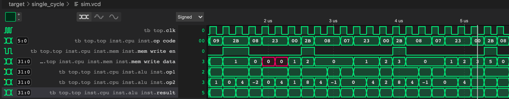

# MIPSLAB

Computer orgnization courseworks in XJTU.

By Junyang Zhang.

## Branch NarrowSingleCycle

This is a branch that maintains the "pure" single cycle version of the CPU, which means that each instruction takes exactly 1 cycle. And the major components are combinational logic.

For more infomation, checkout the main branch.

The result of calculating the Fibbonaci numbers and storing into the memory is as follows:

