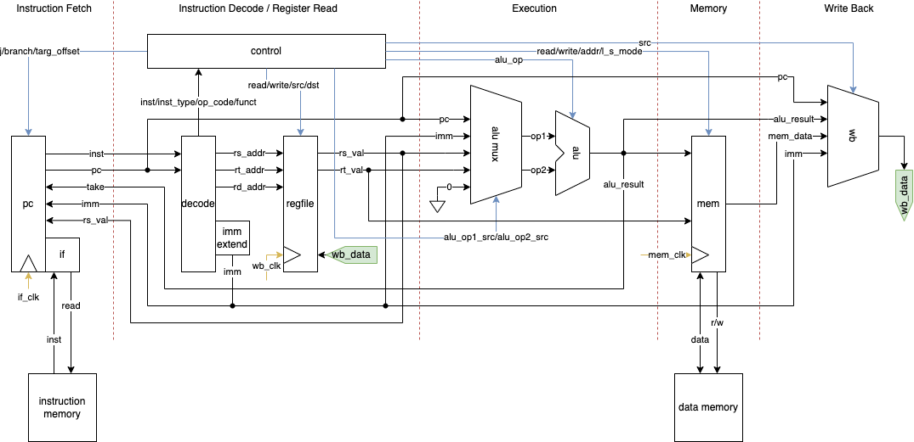
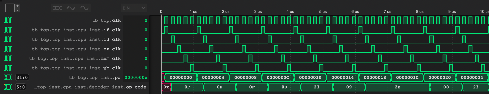
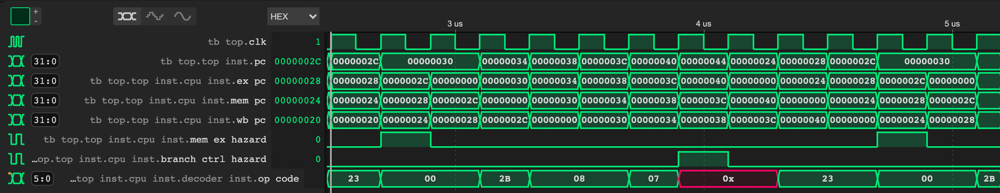

# MIPSLAB

Extension of computer orgnization courseworks in XJTU; implementing some CPUs, all providing a 42 instructions subset of MIPS ISA.

By Junyang Zhang.

## How to run

The project has a testbench also written in Verilog HDL, thus using any simulator other than [Verilator](https://www.veripool.org/verilator/) would be suffice. It is recommended to use [Icarus Verilog](http://iverilog.icarus.com/) as a simulator, and other platforms such as [Modelsim](https://eda.sw.siemens.com/en-US/ic/modelsim/), [Vivado](https://china.xilinx.com/products/design-tools/vivado.html), [Quartus](https://www.intel.com/content/www/us/en/software/programmable/quartus-prime/download.html) are yet to be tested.

### Installing Icarus Verilog

It is recommended to work with Linux or Unix-like systems. If you wish to install Icarus Verilog in Windows (without WSL), please do some research.

In MacOS: ([Homebrew](https://brew.sh/))

```sh
brew install iverilog
```

In Debian based distributions: ([apt-get](https://www.debian.org/doc/manuals/debian-handbook/sect.apt-get.zh-cn.html))

```sh
sudo apt-get iverilog
```

### Running simulation

First, clone this repository and `cd` into it.

```sh
git clone https://github.com/James-Hen/MIPSLAB.git
cd MIPSLAB
```

I wrote a handy make script to simulate and generate waveforms.

```sh
make
```

Then the vvp files and waveforms of all targets will be generated in `target/`. Read the waveform with [GTKWave](http://gtkwave.sourceforge.net/), [WaveTrace](https://www.wavetrace.io/), etc.

The target can be selected to build such as `make single_cycle`, `make multicycle`, `make pipeline`.

## Testing

Currently, no auto testing scripts of MIPS ISA are deployed. But anyone could run the processor with their self-written assembly language text and data, generated by [MARS](http://courses.missouristate.edu/kenvollmar/mars/). Please assemble the `.asm` files and load the `.text` segment into `sim/imem.text`, and `.data` segment into `sim/dmem.data`, as hexadecimal text files. The simulatior will read those files and load them into the debug memories.

Some handy assembly programs are given in `sim/MIPS_sample_src`.

## Architecture Overview

The projects now includes four CPU implementation with different architectures, have a quick look to see what will happen.

### Single Cycle Version

The single cycle version is the basis of all variants, which consists of all necessary components. The datapath is illustrated below.



As you can see, the diagram is splitted into 5 stages, which will run in turns by each clock signal. On every positive edge of the clock signal, there would be exactly one stage that is active. This counting is implemented by a counter in `common/single_cycle/counter.v`, which sends out 5 different sub-clock signals.



### Multicycle Version

The multicycle version is just a small improvement of the single cycle version, which instead of asking every stage to run sequentially, skips some or all stages after decoding. This method requires to tailor the stage footprint for every instructions. Fortunately, the types are not too much, since all instructions need "IF" and "ID" stages.

For example, the instruction "LUI" only needs "IF", "ID" and "WB", since the immediate is generated in the "ID" stage; and "ADD" need "IF", "ID", "EX" and "WB", skipping memory accesses.

So, the only modification is about the counter. The counter now need to have `op_code` from "ID" stage, and decide which stages shall be run, and send sub-clocks.


One can see that, it does a non-trivial speedup by adding some trivial work.

In the multicycle version, I implemented a unified memory (both the instruction memory and data memory), for the sake of coursework requirements.

### Pipeline Version

Let the instructions flow!

#### Assume not take

Finished but lazy to document.



#### 2-bit Branch Prediction and Branch Target Buffer

Not finished yet.